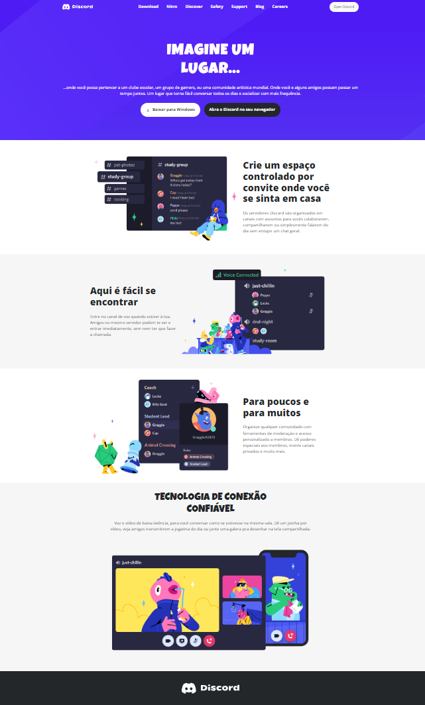

# <h1 align="center">Clone do site Discord</h1>

O projeto é uma proposta de reproduzir a interface do site <b>Discord</b>.

<h2>📊 Features e temas abordados:</h2>

Consiste em um menu de navegação feito pelo Bootstrap e um layout responsivo.

Os recursos presentes:

- Flexbox
- Responsividade 
- Bootstrap
- Pseudo-classes

<h2>⏩ Demonstração</h2>

Você pode acessar ao resultado final do projeto [clicando aqui](https://pedrohenriquebs.github.io/LandingPage-Discord/).

<h2>💻 Preview</h2>

<h2>🚀 Tecnologias utilizadas</h2>

<h2>🔗 Links</h2>

